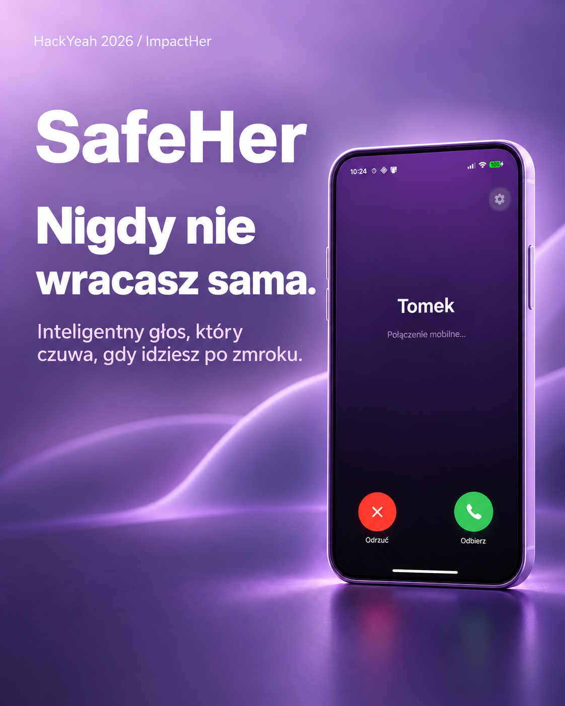

<p align="center">
  
</p>

# SafeHer

**Nigdy nie wracasz sama.**  
Dyskretna ochrona głosowa dla kobiet wracających samotnie — kamuflaż prawdziwego połączenia telefonicznego, agent AI (Gemini Live) i stopniowane alerty SMS do zaufanego kontaktu.

Projekt na **HackYeah 2026 / ImpactHer** · zespół **Dywizjon404**

---

## Problem

Kobiety często czują się niepewnie wracając nocą pustymi ulicami. Klasyczne panic buttony są zbyt jawne — mogą prowokować napastnika albo wymagają decyzji „112 albo nic”.

Powszechna taktyka to *udawanie rozmowy* („Tak, już wchodzę w naszą uliczkę, wyjdź po mnie”). SafeHer wzmacnia tę strategię technologią: wygląda jak telefon od bliskiej osoby, AI prowadzi spokojny dialog, a z rozmowy i GPS powstaje gotowy alert.

## Rozwiązanie

| Filary | Co robi |
|--------|---------|
| **Kamuflaż dialera** | Ekran Incoming / Active Call wygląda jak natywne połączenie (np. „Tomek”) |
| **Głos AI** | Gemini Live prowadzi rozmowę po polsku jak bliska osoba — bez zdradzania, że to aplikacja |
| **Safe havens** | Overpass / OSM podaje pobliskie stacje, apteki, sklepy, posterunki |
| **Alerty SMS** | L1 (lokalizacja + kontekst) → L2 (pilna pomoc) → fail-safe przy błędnym PIN |
| **Sprawczość** | Aplikacja **nie** dzwoni automatycznie pod 112 — decyzję zostawia użytkowniczce i bliskim |

### Przepływ

1. **Konfiguracja** — imię na ekranie, numer zaufany, 4-cyfrowy PIN (bez konta).
2. **Odbierz** — start WebSocket + mikrofon + lokalizacja.
3. **Rozmowa** — AI wita, wskazuje pobliski bezpieczny punkt, dyskretnie zbiera kontekst (ubiór, dystans, punkt orientacyjny).
4. **Eskalacja** — 3× nazwa kontaktu = L1, kolejne 3× = L2; zakończenie wymaga PIN (3 błędy → alert alarmowy).

---

## Stack

```
Android (Expo / RN) ──WebSocket PCM──▶ FastAPI ──▶ Gemini Live
         │                                │
         │                                └──▶ Overpass (OSM)
         └── SMS / lokalizacja (natywnie)
```

| Warstwa | Technologie |
|---------|-------------|
| Mobile | React Native 0.86, Expo 57, TypeScript, Kotlin (`safeher-audio`) |
| Backend | Python, FastAPI, Uvicorn, WebSockets, Pydantic |
| AI | Gemini Live (`gemini-2.5-flash-native-audio-preview`) |
| Mapa | Overpass API / OpenStreetMap |
| Alerty | `expo-sms`, `expo-location`, AsyncStorage |

Audio: PCM16 mono — wejście 16 kHz / wyjście 24 kHz (paczki ~40 ms).

---

## Struktura repo

```
SafeHer/
├── SPEC.md                 # Specyfikacja produktowa
├── shared/
│   ├── PROTOCOL.md         # Kontrakt WebSocket
│   └── ws-types.ts
├── backend/
│   ├── .env.example
│   ├── requirements.txt
│   └── app/                # FastAPI + live bridge + Overpass
├── mobile/                 # Expo + dialer UI + natywne audio
│   ├── modules/safeher-audio/
│   └── STAGE2.md           # Build Androida (dev client)
└── output/social/          # Grafiki / materiały
```

---

## Quick start

### Wymagania

- Python 3.11+
- Node.js 20+
- Android SDK + JDK 17
- Klucz [Gemini API](https://aistudio.google.com/apikey)
- **Development build** Androida (Expo Go nie obsługuje lokalnego modułu audio)

### 1. Backend

```powershell
cd backend
py -3 -m venv venv
.\venv\Scripts\Activate.ps1
pip install -r requirements.txt
copy .env.example .env
# uzupełnij GEMINI_API_KEY w .env

uvicorn app.main:app --host 0.0.0.0 --port 8000
```

Health: `http://localhost:8000` · WebSocket: `ws://<host>:8000/ws/live`

### 2. Mobile

```powershell
cd mobile
npm install
copy .env.example .env
```

W `mobile/.env`:

| Środowisko | `EXPO_PUBLIC_WS_URL` |
|------------|----------------------|
| Emulator Android | `ws://10.0.2.2:8000/ws/live` |
| Telefon (ta sama sieć Wi‑Fi) | `ws://<IP_PC>:8000/ws/live` |

```powershell
npx expo run:android
```

Szczegóły (JDK, clean rebuild): [`mobile/STAGE2.md`](mobile/STAGE2.md)

### 3. Pierwsze uruchomienie w aplikacji

1. Ustaw kontakt (np. „Tomek”), numer zaufany i PIN.
2. Na ekranie połączenia kliknij **Odbierz**.
3. Powiedz np.: *„Ten w czarnej kurtce idzie za mną”*.
4. 3× dotknij nazwy kontaktu → sprawdź przygotowany SMS.
5. Zakończ rozmowę poprawnym PIN-em.

---

## Funkcje MVP

- [x] Kamuflaż IncomingCall / ActiveCall
- [x] Dwukierunkowe audio PCM (Kotlin) ↔ Gemini Live
- [x] Safe havens z Overpass na starcie rozmowy
- [x] Ekstrakcja kontekstu → szkic SMS z lokalizacją
- [x] Eskalacja L1 / L2 + PIN anti-duress
- [x] Wyciszenie mikrofonu, ustawienia lokalne
- [x] Trigger z powiadomienia / lockscreen (Android)
- [ ] Pełny live GPS tracking
- [ ] Hardware power×3 (spec)
- [ ] iOS / produkcyjne WSS + auth

---

## Protokół i docs

- Specyfikacja: [`SPEC.md`](SPEC.md)
- Kontrakt WS: [`shared/PROTOCOL.md`](shared/PROTOCOL.md)
- Typy klienta: [`shared/ws-types.ts`](shared/ws-types.ts)

---

## Bezpieczeństwo i prywatność

- Klucz Gemini zostaje **wyłącznie** w backendzie (`.env`, nie w APK).
- Brak kont użytkowników — ustawienia lokalnie na urządzeniu.
- Głos i lokalizacja trafiają do Gemini / Overpass w trakcie sesji — przed pilotażem: WSS, limity, minimalizacja logów.
- Aplikacja **nie** zastępuje służb ratunkowych.

---

## Zespół

**Dywizjon404** — HackYeah 2026 / ImpactHer

---

## Licencja

Projekt hackathonowy — rights reserved by the team unless stated otherwise.
